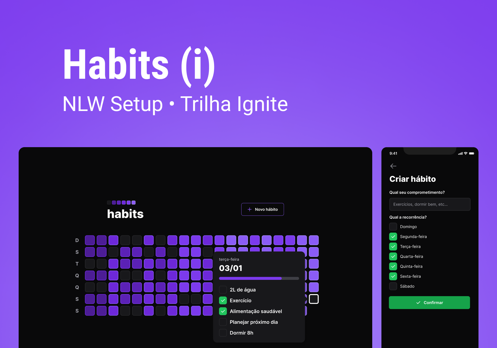

<div align="center">
  
</div>

<hr />

<p align="center">
  

 
</p>

<br />

<p align="center">
  
</p>

## 🚀 Tecnologias

- ReactJs
- Tailwind
- NodeJs
- Prisma
- React Native
- Typescript
- Expo

## 💻 Projeto

Tracker de hábitos, uma ferramenta de acompanhamento de hábitos para o usuário colocar em prática suas resoluções e metas, é registrar diariamente as ações e acompanhar a evolução dos hábitos.

Projeto desenvolvido durante o NLW#11 (Next Level Week)#11 ministrado pela [Rocketseat](https://github.com/rocketseat).

## 🚀 Getting started

Clone the project and access the folder.

```bash
$ git clone https://github.com/rafael-camara/habits.git
$ cd habits
```

### Web

```bash
# Install dependencies
$ cd web
$ npm install
# Start project
$ npm start
```

### Server

```bash
# Install dependencies
$ cd server
$ npm install
# Start Project
$ npm run dev
```

### Mobile

```bash
# Install dependencies
$ cd mobile
$ npm install
# Start project
$ npm start
```

## 🔖 Layout

Nos links abaixo você encontra o layout do projeto web e também do mobile. Lembrando que você precisa ter uma conta no [Figma](http://figma.com/) para acessá-lo.

- [Layout](https://www.figma.com/community/file/1195326661124171197)

## :memo: Licença

Esse projeto está sob a licença MIT. Veja o arquivo [LICENSE](LICENSE.md) para mais detalhes.

---
Feito com ♥️ por [Rafael Câmara](https://github.com/rafael-camara)